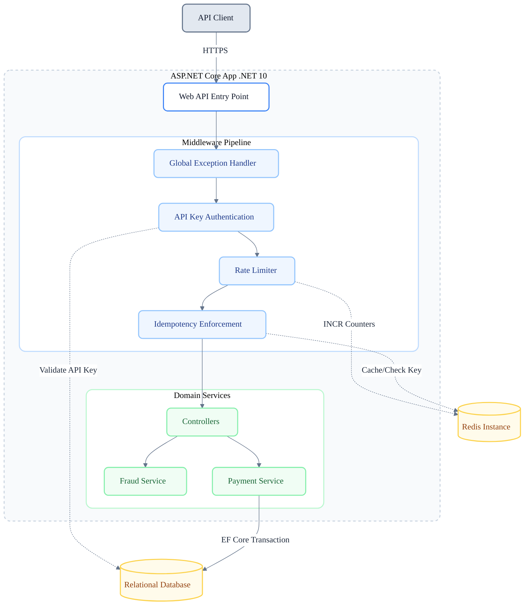
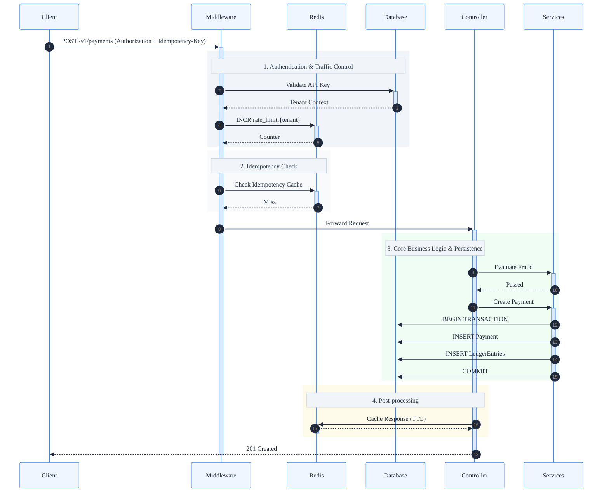

# FluxPay Architecture and Technical Documentation

## 1. Project Overview

FluxPay is an API-first payment processing platform built on **.NET 10**.  
It is designed to provide secure, reliable, and idempotent transaction processing similar to modern payment gateways.

The system prioritizes:

- Data consistency (ACID guarantees)
- Strict tenant isolation
- Deterministic idempotency
- Distributed rate limiting
- Fail-fast middleware enforcement
- Clean domain boundaries

FluxPay is structured to evolve toward a cloud-native deployment model while maintaining correctness at the transactional layer.

---

## 2. High-Level Architecture

FluxPay follows a layered, stateless architecture:

- **API Layer** — ASP.NET Core Web API endpoints  
- **Middleware Pipeline** — Authentication, rate limiting, idempotency enforcement  
- **Domain Services** — Payment orchestration and fraud evaluation  
- **Redis Instance** — Distributed state (rate limiting + idempotency caching)  
- **Relational Database** — ACID-compliant persistence (SQLite in development)  

The API layer is stateless and horizontally scalable.



---

## 3. Request Lifecycle (Detailed Flow)



---

## 4. Middleware Pipeline

Middleware is intentionally ordered to shed invalid traffic early.

1. **Global Exception Middleware**
   - Standardizes errors into RFC 7807 Problem Details format.

2. **API Key Authentication**
   - Extracts Bearer token.
   - Validates against database.
   - Establishes Tenant context.
   - Rejects unauthorized requests (401).

3. **Rate Limiting**
   - Redis-backed counter using `INCR`.
   - Enforces per-tenant request thresholds.
   - Returns HTTP 429 when exceeded.

4. **Idempotency Validation**
   - Requires `Idempotency-Key` header for mutating endpoints.
   - Checks Redis cache.
   - Prevents duplicate processing.

---

## 5. Data Model

FluxPay uses logical multi-tenancy.

All core entities include a `TenantId` column to enforce isolation.

### ApiKey

- Id  
- Key  
- TenantId  
- IsActive  

### Payment

- Id  
- TenantId  
- Amount  
- Currency  
- Status  
- IdempotencyKey  
- CreatedAt  

### LedgerEntry

Represents double-entry accounting records.

Each payment generates:

- Merchant credit entry  
- Platform debit entry  

This ensures balanced accounting at the persistence layer.

---

## 6. Idempotency Strategy

Idempotency is enforced through two layers:

### Layer 1 — Redis Cache

- Checks if an Idempotency-Key already exists.
- If cached response exists → return cached result.
- If not → continue processing.

After successful commit:
- Serialized response stored in Redis with TTL (e.g., 24h).

### Layer 2 — Database Constraint

A unique constraint on:

```
(TenantId, IdempotencyKey)
```

Guarantees structural prevention of duplicate records.

This ensures correctness even if Redis state is lost.

---

## 7. Rate Limiting

Rate limiting is implemented using Redis.

Mechanism:

- Key format: `rate_limit:{tenant}:{window}`
- Operation: `INCR`
- TTL applied on first increment
- Threshold comparison performed

Exceeding threshold results in:

```
HTTP 429 Too Many Requests
Retry-After header included
```

The API remains stateless while rate enforcement remains distributed.

---

## 8. Fraud Detection

Fraud evaluation occurs before persistence.

### Abstraction

`IFraudService` defines pluggable risk evaluation.

### Current Implementation

- Amount threshold validation
- Basic velocity checks

Fraud rejection returns:

```
HTTP 422 Unprocessable Entity
```

No transaction is initiated if fraud validation fails.

---

## 9. Transaction & Consistency Model

Financial correctness is enforced using EF Core transactions.

- Payment + LedgerEntries wrapped in single transaction
- Atomic commit
- No partial writes allowed
- Relies on database-level isolation (Read Committed or stricter)

Failure at any step results in full rollback.

---

## 10. Error Handling

All errors conform to RFC 7807.

- Domain errors mapped to proper status codes
- Infrastructure errors masked from client
- Trace identifiers included for observability
- Internal stack traces not exposed

---

## 11. Health & Observability

### Liveness
`/health/live`
- Confirms HTTP pipeline availability.

### Readiness
`/health/ready`
- Validates Redis connectivity
- Validates database connectivity
- Returns 503 if dependencies unavailable

Designed for Kubernetes readiness probes.

---

## 12. Docker & Deployment Model

FluxPay is containerized using a multi-stage Dockerfile.

- Build stage: .NET SDK image
- Runtime stage: ASP.NET runtime image
- Minimal attack surface
- Deterministic builds

Local development supported via `docker-compose`.

---

## 13. Scalability Characteristics

- Stateless API layer
- Horizontally scalable
- Redis-backed distributed coordination
- Database transactions enforce correctness

Production deployment may require:

- Redis clustering
- Connection pool tuning
- Azure SQL migration

---

## 14. Security Considerations

- HTTPS-only communication
- No secrets committed to source control
- No sensitive credentials in code
- Tenant isolation enforced at data layer
- Idempotency prevents replay duplication
- Structured error responses prevent information leakage

---

## 15. Planned Cloud Evolution

Future enhancements include:

- Azure SQL Database (HA + replication)
- Azure Kubernetes Service (AKS)
- Azure Key Vault for secret management
- Azure Monitor integration
- Private networking and managed identity
- Asynchronous event distribution (Service Bus)